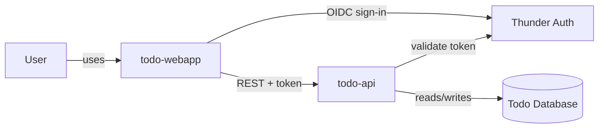
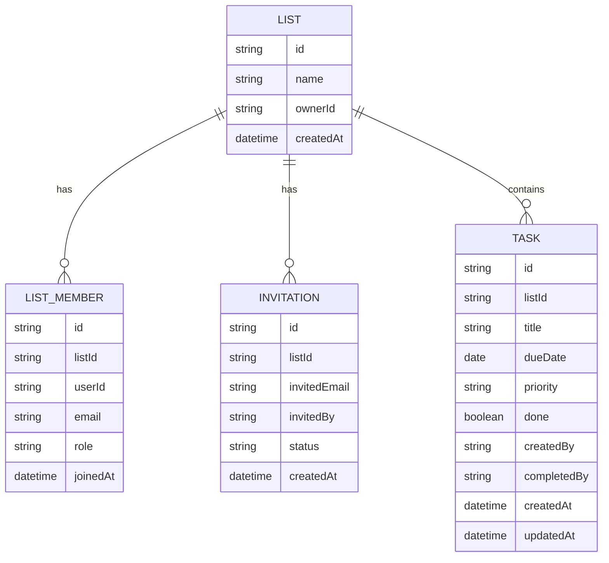
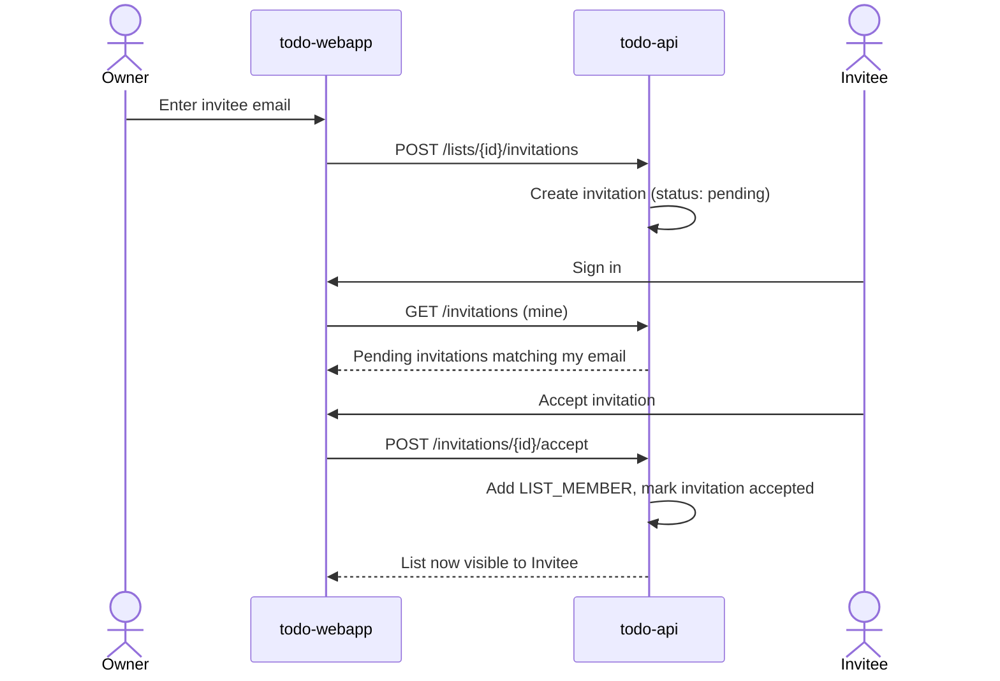
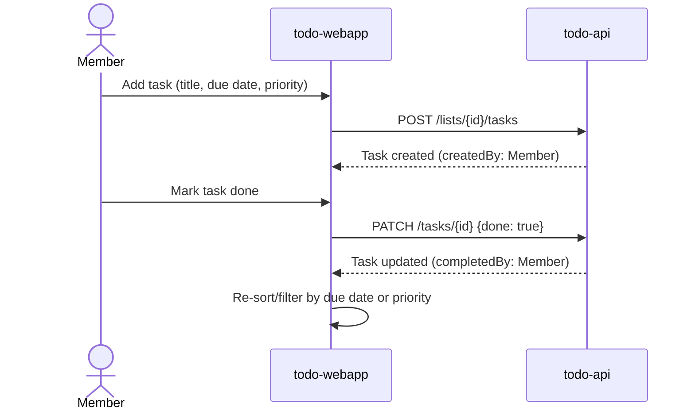

# todoooo111 — Design

Collaborative to-do lists: a single-page React app (`todo-webapp`) talking to
one Ballerina API (`todo-api`), which persists lists, membership, invitations,
and tasks in its own Postgres database and sits behind Thunder for sign-in.
There is no separate notification channel — invitations surface in-app to
whichever signed-in user's account email matches the invite.

## Context (C1)

## Domain model (ER)

`LIST_MEMBER.role` is `owner` or `member`. `INVITATION.status` is `pending`,
`accepted`, or `declined`. `TASK.priority` is `low`, `medium`, or `high`.
`TASK.createdBy`/`completedBy` are the acting user's id, surfaced in the UI so
collaborators see who added and who completed each task.

## Key flows

### Invite and join a shared list

### Add and complete a task

